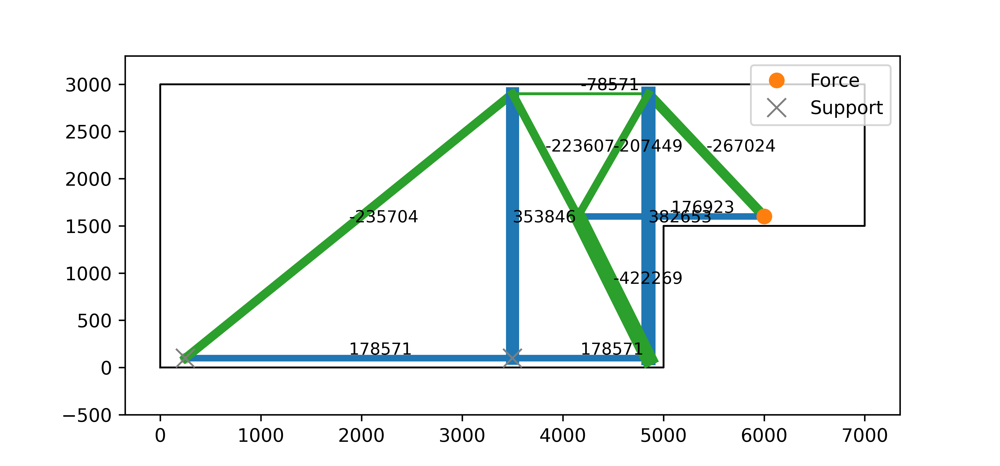
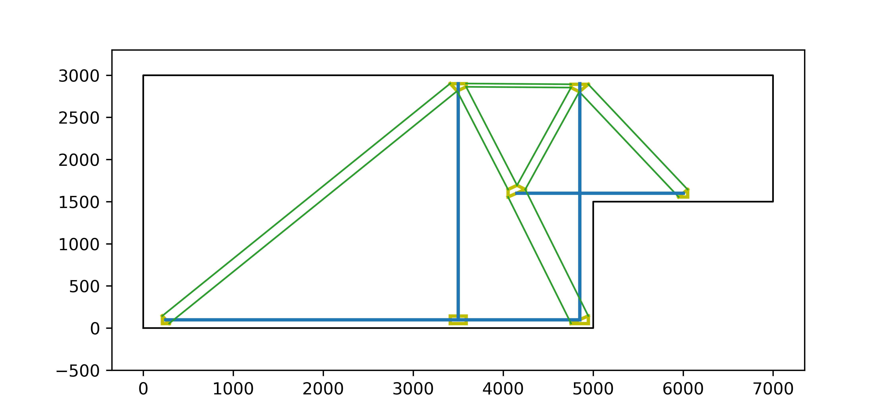

# Strut-and-Tie Modelling
This repository contains a python-based project for the design with strut-and-tie models and concentrated stress fields for reinforced concrete structures. It includes the evaluation of hydrostatic nodal zones for stress fields. The user should be familiar with these design methods and the responsibility of the results lies with the user.

The current version is 0.2. It includes the validation of strut-and-tie models and the evaluation of hydrostatic nodal zones for stress fields with concentrated struts and ties. For the hydrostatic nodal zones the same center of forces as for the corresponding strut-and-tie models are assumed. Each tie is fully anchored at the nodes. If there are more than three edges acting at one node, then two cases are differentiated. If two ties lie on one plane then the smaller one is removed (as they balance each other out). Otherwise, two edges with the lowest inbetween angle are replaced through one statically equivalent strut.

<figure>

<figcaption>Example of a strut-and-tie model (top) of a dapped-end beam and its corresponding stress fields with hydrostatic nodes (bottom).</figcaption>
</figure>

## Getting started
* For required python packages, please check out the requirements file.
* Please check out the following two example jupyter notebook files: stm_example_simple_beam.ipynb with the example of a simple beam incl. how a truss can be assembled, a strut-and-tie model be validated and to check the stress fields and nodal zones. The second example stm_example_deb.ipynb is of a dapped-end beam.

## Authors
* **Karin Yu**, ETH Zürich, [strukturen](https://github.com/strukturen) or [my website](http://www.karinyu.com)

## Contact/Support
If you encounter problems or have questions please reach out to karin.yu(a)ibk.baug.ethz.ch.

## License
This project is licensed under the Apache License, Version 2.0: http://www.apache.org/licenses/LICENSE-2.0

## Acknowledgements
* My supervisors: Prof. Dr. Michael A. Kraus, Prof. Dr. Walter Kaufmann and Prof. Dr. Eleni Chatzi.